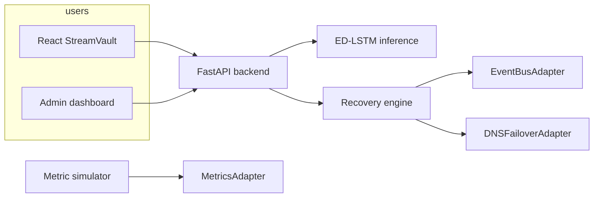

# StreamVault — Intelligent Cloud Disaster Recovery (academic demo)

**Intelligent Cloud Disaster Recovery System using Machine Learning** — Video streaming experience with an admin control plane for proactive failover driven by an Encoder–Decoder LSTM (ED-LSTM) on multivariate metrics.

> **Note on folder naming:** the design doc refers to a top-level `platform/` package. In this repository the same code lives under **`cloud_adapters/`** because a Python package named `platform` shadows the standard library and breaks dependencies (for example SQLAlchemy). All documentation paths use `cloud_adapters/` explicitly.

## Architecture (summary)

- **Edge:** Route 53 (DNS failover) — abstracted via `DNSFailoverAdapter`.
- **App tier:** React (Vite) user app + separate admin dashboard; FastAPI backend on EC2 behind ALB (conceptually).
- **Data:** RDS-compatible SQLAlchemy URL (SQLite locally); S3-compatible `StorageAdapter`.
- **Observability:** CloudWatch-style metrics via `MetricsAdapter`; local simulator pushes CPU, request rate, latency, network, errors.
- **Events:** EventBridge-style `EventBusAdapter`; Lambda-style `RecoveryAdapter`.
- **ML:** ED-LSTM in `services/ml_predictor` (TensorFlow/Keras) with dynamic thresholding on prediction error (mean ± *k*·σ on recent errors).
- **Messaging:** SNS (`NotificationAdapter`) and SQS (`QueueAdapter`) with mock implementations for local demo.



## Features

| Area | What you get |
|------|----------------|
| Streaming UX | Hero, search, categories, detail + player pages, continue watching, JWT demo auth |
| DR console | Region status, charts, ED-LSTM forecast strip, scenarios, manual failover, timeline |
| ML | Train script → `services/ml_predictor/models/ed_lstm_demo.keras`, inference + anomaly scoring |
| AWS swap-in | All SDK usage isolated under `cloud_adapters/aws/`; mocks under `cloud_adapters/mocks/` |

## Tech stack

- **User UI:** React 18, TypeScript, Vite 6, Tailwind CSS — `apps/frontend/`
- **Admin UI:** React 18, TypeScript, Vite, Tailwind, Recharts — `apps/admin-dashboard/`
- **API:** FastAPI, SQLAlchemy async, SQLite local — `apps/backend/app/`
- **ML:** TensorFlow/Keras — `services/ml_predictor/`
- **Python:** 3.10+ recommended; 3.9 possible with `eval-type-backport` (see `requirements.txt`)

## Quick start (local / mock)

Exact commands and paths are in **`docs/RUN_INSTRUCTIONS.md`**.

1. Create a virtualenv, `pip install -r requirements.txt`.
2. `cp .env.example .env` — keep `APP_MODE=mock`.
3. `PYTHONPATH=. python scripts/seed_data.py`
4. `PYTHONPATH=. python -m uvicorn apps.backend.app.main:app --reload --port 8000`
5. `cd apps/frontend && npm install && npm run dev`
6. `cd apps/admin-dashboard && npm install && npm run dev` (port **5174**)
7. (Optional) Train the ED-LSTM: `PYTHONPATH=. python services/ml_predictor/train.py`

**Demo logins:** see `apps/backend/app/demo_accounts.py` (seeded by `scripts/seed_data.py`). The sign-in page loads them from `GET /api/auth/demo-accounts` in mock mode so you can one-click fill email/password.

## Demo flow (for presentations)

1. Open user app → browse and play sample streams (Big Buck Bunny sample URLs).
2. Open admin → watch live metric chart update.
3. Trigger a **scenario** (CPU spike, surge, etc.) → metrics react.
4. Click **Run ED-LSTM + policy** → see JSON decision; optional proactive failover when thresholds hit.
5. Use **Failover to DR** / **Fail back** for a deterministic story.

## Screenshots (placeholders)

Add your own captures before submission:

- `docs/screenshots/user-home.png` — hero + rows
- `docs/screenshots/player.png` — video player
- `docs/screenshots/admin-dr.png` — DR console + charts

## Switching from mock to AWS

- **Quick demo on one EC2 (mock mode, no extra AWS services):** **`docs/AWS_DEMO_SINGLE_EC2.md`**
- **End-to-end deploy (CLI, EC2, RDS, bootstrap script):** **`docs/AWS_DEPLOYMENT_CLI.md`**
- **Adapter / env reference:** **`docs/AWS_INTEGRATION_GUIDE.md`**

Set `APP_MODE=aws`, `USE_REAL_AWS=true`, fill AWS env vars (see `.env.aws.example`), run `python scripts/verify_aws_connection.py`.

## Troubleshooting

| Issue | Fix |
|--------|-----|
| `ModuleNotFoundError` for `apps` | Export `PYTHONPATH=.` from repository root |
| CORS errors | Add your dev origin to `CORS_ORIGINS` in `.env` |
| ML always “mock” | Train model to `services/ml_predictor/models/ed_lstm_demo.keras` or configure SageMaker endpoint |
| `No module named 'greenlet'` | Run `pip install greenlet` (listed in `requirements.txt` for SQLAlchemy asyncio) |
| `No matching distribution found for tensorflow` | Use Python 3.10–3.12 in a venv; `requirements.txt` pins TensorFlow to a current PyPI release. On Python 3.13+, TensorFlow may be unavailable—use 3.12 or comment out `tensorflow` for API-only demo |
| `uvicorn: command not found` | Activate `.venv` or run `python -m uvicorn ...` |
| Python 3.9 typing errors | `pip install eval-type-backport` or upgrade to 3.10+ |

## Project structure (abbreviated)

```
apps/frontend/          # End-user streaming UI
apps/admin-dashboard/   # DR / monitoring console
apps/backend/           # FastAPI API
cloud_adapters/aws/     # boto3 adapters (S3, CloudWatch, …)
cloud_adapters/mocks/   # Local demo implementations + shared state
services/ml_predictor/  # ED-LSTM train + inference
services/monitoring/    # Metric simulator
services/recovery_orchestrator/
shared/contracts/       # Protocol interfaces
infrastructure/cloudformation/
scripts/
docs/
```

## Team

| Name | GitHub |
|------|--------|
| Shruthi Katta | [@shruthikatta](https://github.com/shruthikatta) |
| Rohan Aren | [@aren350](https://github.com/aren350) |
| Rishikesh Reddy Aluguvelli | [@Rishikesh-Reddy](https://github.com/Rishikesh-Reddy) |
| Vikramadithya Baddam | [@Vikramadithya-baddam](https://github.com/Vikramadithya-baddam) |

## License / academic use

Built for coursework; sample video links point to publicly hosted demo assets—verify licensing for your class policies.
