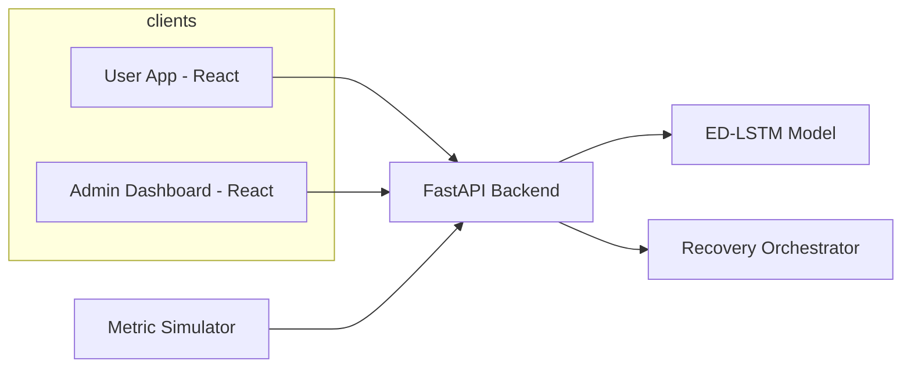

# CMPE 281 — Intelligent Cloud Platform

## Assignment 4: Component Implementation

**Project:** StreamVault — Intelligent Cloud Disaster Recovery

**Submission (course):** Team PDF, 3–5 pages, including a **diagram and explanation** (this file is Markdown source; export to PDF as required).

---

### Team members and contributions

| Name | Application development | Cloud / infrastructure |
|------|-------------------------|-------------------------|
| Shruthi Katta | Admin dashboard; backend APIs (catalog, users); documentation | ML inference on AWS (e.g., SageMaker); event, notification, and DNS adapters; deployment guides |
| Rohan Aren | User streaming app; authentication; metrics and recovery services | Deployment planning; runtime, networking, and configuration |
| Rishikesh Reddy Aluguvelli | Backend services and schemas; local ML training; Docker setup | Terraform (with Vikram); AWS adapter integration; run documentation |
| Vikramadithya Baddam | Admin experience; data models; ML predictor service | Terraform (with Rishikesh); storage, observability, recovery hooks |

---

### Objective

Implement the designed cloud system components for StreamVault, demonstrate **working interaction** between components, and document **deployment**, **efficiency**, and **demonstration** evidence per the assignment.

---

### Architecture — diagram and explanation

The architecture separates **two web clients** (viewer + operator), a single **REST API**, **metric simulation or CloudWatch-backed metrics**, **ED-LSTM prediction** (local file or SageMaker endpoint in AWS mode), and a **recovery orchestrator** (EventBridge, optional Lambda, Route 53, SNS/SQS).

**Explanation:** End users and admins call the same backend over **REST**. The backend builds metric windows for ML, runs **failover / warn / monitor** policy through the orchestrator, and uses **pluggable adapters** so the same code runs in **mock mode** (local) or **AWS mode** (Terraform-provisioned services).

<!-- SCREENSHOT_PLACEHOLDER: Optional static architecture image for PDF -->
  
*(Image files: `docs/screenshots/` — paths relative to this file.)*

---

## 1. Core components

*(Assignment requirement: frontend or client; backend; cloud compute and storage.)*

### 1.1 Frontend / client interface

| Application | Purpose |
|-------------|--------|
| **User streaming UI** (`apps/frontend/`) | Browse videos, search, playback, authentication |
| **Admin dashboard** (`apps/admin-dashboard/`) | Monitor metrics, simulate failures, run ML prediction, trigger recovery |

**Technologies:** React, TypeScript, Vite, Axios (`VITE_API_URL` for API base).

### 1.2 Backend services

FastAPI provides **REST** JSON APIs, including:

- **Authentication** (JWT), user and video management, watch history  
- **Admin:** metrics, scenarios, failover control, prediction (`/api/admin/...`)  
- **Modules:** recovery orchestrator (`services/recovery_orchestrator/`), monitoring simulator (`services/monitoring/`), ML integration via `cloud_adapters/dependency_factory.py`

### 1.3 Cloud resources

| Category | Services (AWS) | Purpose |
|----------|----------------|---------|
| **Compute** | EC2 or containers (planned for API host); **Lambda** (recovery automation) | Run API; invoke recovery workflows |
| **Serverless / ML** | **SageMaker endpoint** (optional hosted ED-LSTM inference when configured) | Cloud-hosted model inference |
| **Storage** | **RDS (MySQL)**; **S3** | Application data; object / media storage |
| **Observability** | **CloudWatch** | Metric read/write for dashboards and windows |
| **Integration** | **EventBridge**, **SNS**, **SQS** | Events, alerts, queues |
| **Networking** | **Route 53** | DNS / failover narrative |

**Infrastructure as code:** Resources are provisioned with **Terraform** (`terraform plan`, `terraform apply`). Configure the API with outputs and variables from `.env.aws.example`.

---

## 2. Functional integration

*(Assignment requirement: correct communication; demonstrate REST, data exchange, end-to-end workflow.)*

### 2.1 API communication (REST)

Frontends use **REST** over HTTP with JSON bodies. Representative endpoints:

| Method | Path | Role |
|--------|------|------|
| GET | `/api/admin/overview` | DR overview |
| GET | `/api/admin/metrics/series` | Chart data |
| POST | `/api/admin/scenario` | Inject failure scenario |
| POST | `/api/admin/failover/manual` | Manual failover |
| POST | `/api/admin/prediction/run` | ML + policy decision |

### 2.2 Data exchange between services

- **Client → API:** JWT on protected routes; shared JSON schemas for admin actions.  
- **API → AWS (when `APP_MODE=aws` / `USE_REAL_AWS`):** adapters for S3, CloudWatch, EventBridge, Lambda, Route 53, SNS, SQS, SageMaker Runtime as configured.  
- **Mock mode:** In-memory / mock adapters for local integration without AWS calls.

### 2.3 End-to-end workflow

1. User logs in and streams video.  
2. Admin monitors live metrics.  
3. Operator injects a **scenario** (e.g., CPU spike).  
4. **ED-LSTM** prediction runs (local Keras and/or **SageMaker** + recovery policy).  
5. **Warn** or **failover** path updates state; EventBridge event recorded; optional Lambda, DNS, and notifications.

<!-- SCREENSHOT_PLACEHOLDER: User app -->

<!-- SCREENSHOT_PLACEHOLDER: Admin DR console -->

---

## 3. Deployment

*(Assignment requirement: cloud platform — **AWS**; deployment steps or **scripts**; **screenshots or logs** as proof.)*

### 3.1 Platform and scripts

- **Cloud:** **AWS**, managed with **Terraform**.  
- **Steps / scripts:** Clone repo → configure `.env` / `.env.aws` → `terraform plan` → `terraform apply` → align env vars with outputs (**paste your team’s Terraform path**). Supplementary CLI notes: `docs/AWS_DEPLOYMENT_CLI.md`, `docs/AWS_INTEGRATION_GUIDE.md`, `docs/SAGEMAKER_ENDPOINT.md` (if using SageMaker).

### 3.2 Proof of deployment

- **Logs:** Terraform plan/apply output (redact secrets).  
- **Screenshots:** AWS Console views of key resources (VPC, S3, Lambda, SageMaker endpoint, etc.).

<!-- SCREENSHOT_PLACEHOLDER: Terraform apply -->

<!-- SCREENSHOT_PLACEHOLDER: AWS resources -->

### 3.3 Current status and next steps

- **Current:** Full stack runs **locally** with integrated workflows; **AWS resources exist** from Terraform.  
- **Next:** Host API (and optional static frontends) on **EC2/ECS** behind a load balancer; wire **Route 53** and env from Terraform outputs; containerize where helpful.

<!-- SCREENSHOT_PLACEHOLDER: Local API -->

---

## 4. Efficiency considerations

*(Assignment requirement: **response time**, **resource usage**, **proper service configuration**; **screenshots** as evidence.)*

| Area | Approach |
|------|----------|
| **Response time** | Async database access (SQLAlchemy); SPAs built as static assets for production; SageMaker vs local model is a configurable latency/cost tradeoff (`ML_USE_SAGEMAKER`, `SAGEMAKER_ENDPOINT_NAME`) |
| **Resource usage** | Right-size compute for `uvicorn`; **RDS** vs SQLite in cloud; **IAM roles** on instances (`USE_IAM_ROLE`) instead of long-lived keys where possible |
| **Service configuration** | Central env (`shared/config/settings.py`, `cloud_adapters/aws/config/aws_settings.py`); **CORS** via `CORS_ORIGINS`; feature flags `ENABLE_SNS` / `ENABLE_SQS` |

<!-- SCREENSHOT_PLACEHOLDER: e.g., CloudWatch or RDS -->

---

## 5. Demonstration

*(Assignment requirement: **demo video or screenshots**; **sample inputs and outputs**; **test cases**.)*

### 5.1 Visual demonstration

- Short **demo video** and/or **screenshots** of user app, admin console, prediction, and failover story.  
- Place files under `docs/screenshots/` or attach to LMS as instructed.

### 5.2 Sample inputs and outputs

**Sample logins** (demo seed only; not for production):

| Role | Email | Password |
|------|-------|----------|
| User | `demo@streamvault.io` | `demo1234` |
| Admin-style | `admin@streamvault.io` | `admin1234` |

**Sample API checks** (after `PYTHONPATH=. python scripts/seed_data.py`):

| Input | Output (expected) |
|-------|-------------------|
| `GET /api/health` | `200`, status JSON |
| `POST /api/auth/login` with email/password | JWT |
| `GET /api/admin/metrics/series?minutes=60` | Time series for charts |
| `POST /api/admin/prediction/run` | `prediction` + `decision` JSON |

### 5.3 Test cases

| # | Test case | Expected result |
|---|-----------|-----------------|
| 1 | Backend startup + DB seed | No errors; SQLite or RDS connects |
| 2 | Login | JWT issued; protected routes work |
| 3 | Video browse / playback | Seeded catalog plays |
| 4 | Admin metrics | Charts update |
| 5 | Scenario + prediction | Metrics and ML/policy JSON update |
| 6 | Manual failover / fail back | Success response; state updates |
| 7 | `python scripts/verify_aws_connection.py` (with AWS env) | Credentials and reachability OK |

<!-- SCREENSHOT_PLACEHOLDER: Tests or Postman -->

---

## 6. Conclusion

StreamVault delivers an **integrated** streaming and DR-control experience: **React** clients, **FastAPI** backend, **ED-LSTM** prediction with optional **SageMaker**, and **AWS** services **provisioned by Terraform**. **End-to-end behavior** is verified locally with **REST** integration and adapter-based cloud boundaries; **full production hosting** on AWS compute is the planned follow-on.

---

## Evaluation criteria *(assignment rubric)*

| Level | Description | Points |
|-------|-------------|--------|
| **Excellent** | All components fully implemented and functional; efficient execution; seamless integration | 9–10 |
| **Good** | Mostly implemented; minor functionality or efficiency issues; small integration gaps | 7–8 |
| **Satisfactory** | Partially implemented; missing features or inconsistent behavior; limited integration | 5–6 |
| **Poor** | Not implemented or non-functional; major errors; components do not integrate | 0–4 |

---

## Appendix — repository paths

| Component | Path |
|-----------|------|
| User frontend | `apps/frontend/` |
| Admin dashboard | `apps/admin-dashboard/` |
| Backend API | `apps/backend/app/` |
| AWS adapters | `cloud_adapters/aws/` |
| Terraform | *(your team path, e.g. `infrastructure/terraform/`)* |
| Deployment docs | `docs/AWS_DEPLOYMENT_CLI.md`, `docs/AWS_INTEGRATION_GUIDE.md`, `docs/SAGEMAKER_ENDPOINT.md` |
| Env template (AWS) | `.env.aws.example` |
